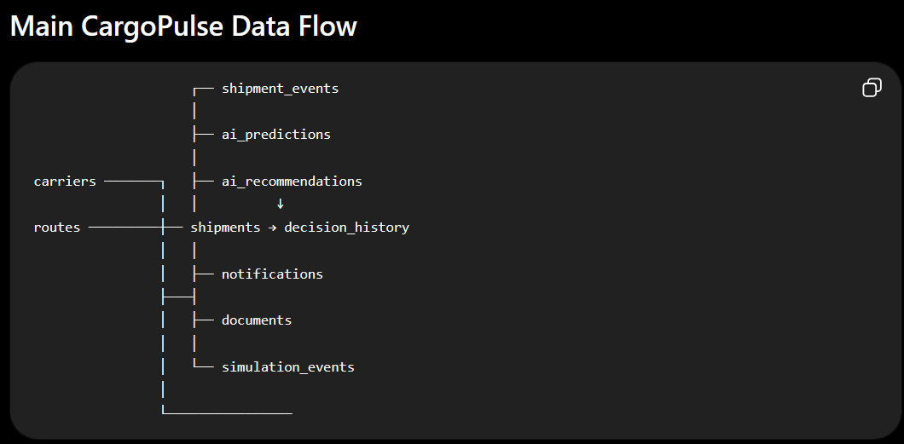

# CargoPulse AI — Database Design

## Database

PostgreSQL

Database name:

cargopulse_ai

## Core Tables

### users
Stores CargoPulse application users.

### carriers
Stores carrier information associated with shipments.

### routes
Stores shipment route information.

### shipments
Central entity containing shipment information.

### shipment_events
Stores chronological shipment events.

### ai_predictions
Stores historical AI prediction records.

Prediction records are append-only.

### ai_recommendations
Stores AI-generated recommendations for shipments.

### decision_history
Stores AI recommendations, manager decisions, and outcomes.

### notifications
Stores shipment-related alerts and notifications.

### documents
Stores metadata for shipment-related documents.

### simulation_events
Stores controlled simulation conditions and simulation history.

### dependency_graph
Stores supply-chain dependency relationships.

## Main Relationship

Shipment has many:

- shipment events
- AI predictions
- AI recommendations
- decisions
- notifications
- documents
- simulation events

## Prediction History Principle

Historical predictions must never be overwritten.

Every prediction cycle creates a new record.

## Data Sources

DataCo Smart Supply Chain:
- historical shipment/business information

Smart Logistics:
- operational/simulation information

The datasets are not blindly concatenated.

## Design Principle

Application data is stored in normalized relational tables rather than one large CSV-style table.

## column definitions and relationship

## 1. users

Stores CargoPulse application users.

| Column | Type | Constraints |
|---|---|---|
| id | Integer | Primary Key |
| name | String | Not Null |
| email | String | Unique, Not Null |
| password_hash | String | Not Null |
| role | String | Not Null |
| created_at | DateTime | Not Null |

---

## 2. carriers

Stores shipping carrier information.

| Column | Type | Constraints |
|---|---|---|
| id | Integer | Primary Key |
| name | String | Not Null |
| code | String | Unique, Not Null |
| created_at | DateTime | Not Null |

---

## 3. routes

Stores shipment route information.

| Column | Type | Constraints |
|---|---|---|
| id | Integer | Primary Key |
| origin | String | Not Null |
| destination | String | Not Null |
| route_code | String | Unique, Nullable |
| created_at | DateTime | Not Null |

---

## 4. shipments

Central entity of CargoPulse.

| Column | Type | Constraints |
|---|---|---|
| id | Integer | Primary Key |
| shipment_reference | String | Unique, Not Null |
| order_id | String | Nullable |
| carrier_id | Integer | Foreign Key, Nullable |
| route_id | Integer | Foreign Key, Nullable |
| shipping_mode | String | Nullable |
| shipment_status | String | Nullable |
| customer_segment | String | Nullable |
| market | String | Nullable |
| order_region | String | Nullable |
| sales | Numeric | Nullable |
| profit_per_order | Numeric | Nullable |
| quantity | Integer | Nullable |
| scheduled_shipping_days | Integer | Nullable |
| current_latitude | Float | Nullable |
| current_longitude | Float | Nullable |
| created_at | DateTime | Not Null |
| updated_at | DateTime | Not Null |

### Intentionally excluded from prediction inputs

- days_for_shipping_real
- shipping_delay_days
- delivery_status
- late_delivery_risk

These can represent future/outcome information and may cause target leakage.

---

## 5. shipment_events

Stores the chronological events of a shipment.

| Column | Type | Constraints |
|---|---|---|
| id | Integer | Primary Key |
| shipment_id | Integer | Foreign Key, Not Null |
| event_type | String | Not Null |
| description | Text | Nullable |
| latitude | Float | Nullable |
| longitude | Float | Nullable |
| event_time | DateTime | Not Null |
| created_at | DateTime | Not Null |

---

## 6. ai_predictions

Stores historical AI prediction records.

| Column | Type | Constraints |
|---|---|---|
| id | Integer | Primary Key |
| shipment_id | Integer | Foreign Key, Not Null |
| delay_probability | Float | Not Null |
| predicted_eta | DateTime | Nullable |
| confidence_score | Float | Nullable |
| prediction_time | DateTime | Not Null |
| model_version | String | Not Null |

### Prediction History Rule

Prediction records are append-only.

A new prediction creates a new database record.

Previous predictions must never be overwritten.

---

## 7. ai_recommendations

Stores AI-generated recommendations.

| Column | Type | Constraints |
|---|---|---|
| id | Integer | Primary Key |
| shipment_id | Integer | Foreign Key, Not Null |
| recommended_action | String | Not Null |
| reason | Text | Nullable |
| expected_delay_reduction | Float | Nullable |
| expected_cost | Numeric | Nullable |
| confidence_score | Float | Nullable |
| created_at | DateTime | Not Null |

---

## 8. decision_history

Stores decisions made after AI recommendations.

| Column | Type | Constraints |
|---|---|---|
| id | Integer | Primary Key |
| shipment_id | Integer | Foreign Key, Not Null |
| recommendation_id | Integer | Foreign Key, Nullable |
| decision | String | Not Null |
| decision_reason | Text | Nullable |
| actual_outcome | Text | Nullable |
| created_at | DateTime | Not Null |

---

## 9. notifications

Stores shipment-related notifications and alerts.

| Column | Type | Constraints |
|---|---|---|
| id | Integer | Primary Key |
| shipment_id | Integer | Foreign Key, Not Null |
| notification_type | String | Not Null |
| message | Text | Not Null |
| severity | String | Not Null |
| is_read | Boolean | Not Null |
| created_at | DateTime | Not Null |

---

## 10. documents

Stores metadata for shipment-related documents.

| Column | Type | Constraints |
|---|---|---|
| id | Integer | Primary Key |
| shipment_id | Integer | Foreign Key, Not Null |
| file_name | String | Not Null |
| file_path | String | Not Null |
| document_type | String | Nullable |
| uploaded_at | DateTime | Not Null |

Document contents will not be stored directly in this table.

---

## 11. simulation_events

Stores controlled simulation conditions.

| Column | Type | Constraints |
|---|---|---|
| id | Integer | Primary Key |
| shipment_id | Integer | Foreign Key, Not Null |
| simulation_time | DateTime | Not Null |
| traffic_status | String | Nullable |
| temperature | Float | Nullable |
| humidity | Float | Nullable |
| waiting_time | Float | Nullable |
| asset_utilization | Float | Nullable |
| latitude | Float | Nullable |
| longitude | Float | Nullable |

---

## 12. dependency_graph

Stores supply-chain dependency relationships.

| Column | Type | Constraints |
|---|---|---|
| id | Integer | Primary Key |
| source_type | String | Not Null |
| source_id | Integer | Not Null |
| target_type | String | Not Null |
| target_id | Integer | Not Null |
| relationship_type | String | Not Null |
| created_at | DateTime | Not Null |

---

# Relationships

## Carrier → Shipments

One carrier can have many shipments.

```text
carriers.id
     ↓
shipments.carrier_id

